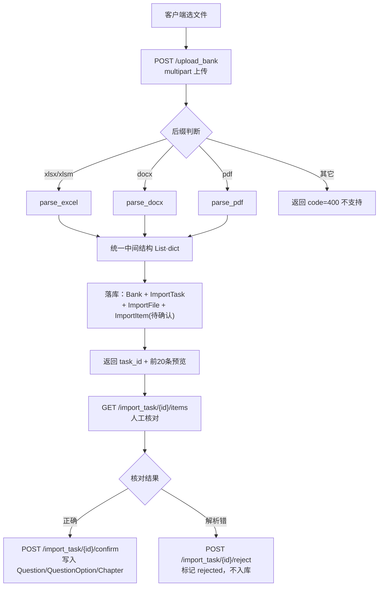

# 题库上传功能说明

> 位置：`d:\LXFastApi\LXFastApi\venv\API\STB\`
> 最后更新：2026-10-04

用户上传 Excel / Word / PDF 题库文件 → 后端解析成结构化题目 → 存为「待确认」明细 → 人工确认后正式写入题库，可以开始刷题。

---

## 一、整体流程



三个阶段的核心动作：

| 阶段 | 做什么 | 涉及表 |
|------|--------|--------|
| ① 上传解析 | 存文件、解析文本、生成待确认明细 | `import_task`、`import_file`、`import_item` |
| ② 人工核对 | 分页读取明细，判断哪条对哪条错 | 只读 `import_item` |
| ③ 确认入库 | 把明细转成正式题目 | `question`、`question_option`、`chapter`，回写 `bank`、`import_task` |

---

## 二、文件职责说明

本次新增 6 个模块，修改 2 个文件。

### 新增文件

| 文件 | 职责 | 关键函数 |
|------|------|----------|
| [parse_deps.py](parse_deps.py) | 依赖加载兜底。把 `d:\LXFastApi\_pylibs` 追加进 `sys.path`，让 `openpyxl` / `python-docx` / `pdfplumber` 能被导入（沙箱不允许写系统 site-packages 的妥协方案） | 无（导入即生效） |
| [parse_common.py](parse_common.py) | **解析核心**。题型归一化、答案归一化、纯文本逐行解析。Excel/Word/PDF 三个解析器都从这里取公共逻辑 | `build_item()`、`parse_text_lines()`、`normalize_q_type()`、`normalize_judge_answer()`、`infer_q_type()` |
| [parse_excel.py](parse_excel.py) | 解析 `.xlsx / .xlsm`。按**表头名字**定位列（不依赖列顺序），多个 sheet 全部解析 | `parse(path) -> (items, meta)` |
| [parse_docx.py](parse_docx.py) | 解析 `.docx`。把每个段落当一行文本，交给 `parse_text_lines()` | `parse(path) -> (items, meta)` |
| [parse_pdf.py](parse_pdf.py) | 解析 `.pdf`。用 `pdfplumber` 按页提取文本后走同一套行解析。**尽力而为，质量差** | `parse(path) -> (items, meta)` |
| [bank_parser.py](bank_parser.py) | 解析入口，按后缀分派到上面三个解析器，并统一抛错文案 | `parse_file(path)`、`get_ext(filename)`、`SUPPORTED_EXTS` |
| [import_service.py](import_service.py) | **数据库层**。文件落盘、建题库和导入任务、写待确认明细、确认入库、忽略明细 | `save_upload_file()`、`create_import_task()`、`confirm_import()`、`reject_items()`、`item_to_dict()` |

### 修改文件

| 文件 | 改了什么 |
|------|----------|
| [ShuTiBao_api.py](ShuTiBao_api.py) | 文末新增 4 个接口：`/upload_bank`、`/import_task/{id}/items`、`/import_task/{id}/confirm`、`/import_task/{id}/reject` |
| [tortoise_models.py](tortoise_models.py) | `User.phone`、`UserAuth.identifier`、`SmsCode.phone` 长度从 `20/64` 放宽到 `128`，以支持邮箱登录 |

### 运行时产生

| 路径 | 说明 |
|------|------|
| `STB/uploads/` | 上传的原始文件落盘目录，文件名带时间戳前缀。**不会自动清理**，需要定期手动清 |
| `d:\LXFastApi\_pylibs\` | 解析依赖库（openpyxl / python-docx / pdfplumber 及其依赖） |

### 统一中间结构

三个解析器都产出同一种结构，后续入库全靠它：

```python
{
    "q_type":    "单选题",                            # 单选题/多选题/判断题/填空题/简答题/名词解释
    "stem":      "刷刷题的网址是",                     # 题干
    "options":   [{"label": "A", "content": "..."}],  # 无选项时为 None
    "answer":    "A",                                 # 判断题统一为 正确/错误；填空多空用 | 分隔
    "analysis":  "解析内容",                           # 可为 None
    "chapter":   "第一章/第一节",                      # 可为 None
    "score":     2,                                   # 可为 None
    "knowledge": None,                                # 知识点，可为 None
    "page_no":   None,
}
```

---

## 三、接口使用方案

服务启动：

```powershell
cd d:\LXFastApi\LXFastApi\venv\API\STB
python -m uvicorn ShuTiBao_api:app --host 0.0.0.0 --port 8000
```

> **重要：错误码约定**
> 接口业务错误统一放在响应体的 `code` 字段里，**HTTP 状态码仍然是 200**。
> 客户端判断成功失败要看 `body.code`，不能只看 HTTP 状态。
> 唯一的例外是参数缺失/类型错误，FastAPI 会直接返回 HTTP 422（格式标准，不带 `code` 字段）。

### 3.1 上传并解析

```
POST /upload_bank
Content-Type: multipart/form-data
```

| 参数 | 位置 | 必填 | 说明 |
|------|------|------|------|
| `file` | form-data (文件) | 是 | 题库文件，支持 `.xlsx` `.xlsm` `.docx` `.pdf` |
| `user_id` | form-data | 是 | 上传用户ID，必须是已存在用户 |
| `bank_name` | form-data | 否 | 题库名称，不传则取文件名（去掉后缀） |
| `subject_id` | form-data | 否 | 科目ID，不传则用「默认科目」（不存在时自动创建） |

成功响应：

```json
{
  "code": 200,
  "task_id": 12,
  "bank_id": 20,
  "bank_name": "第一章练习题",
  "file_name": "shuashuati_excel.xlsx",
  "total": 27,
  "confidence": 100,
  "preview": [ { "q_type": "单选题", "stem": "...", "options": [...], "answer": "A" } ]
}
```

常见失败响应：

| code | error | 触发场景 |
|------|-------|----------|
| 400 | 用户不存在 | `user_id` 在 `user` 表里找不到 |
| 400 | 不支持的文件类型，仅支持 .xlsx / .docx / .pdf（.xls/.doc 请先另存为新格式） | 后缀不在白名单 |
| 400 | 没有解析到任何题目，请检查文件是否符合题库模板 | 文件解析成功但一条题目都没有 |
| 500 | 文件解析失败：xxx | 文件损坏、格式异常等 |

调用的两种写法：

```bash
# curl
curl -X POST "http://127.0.0.1:8000/upload_bank" \
  -F "file=@shuashuati_excel.xlsx" \
  -F "user_id=1" \
  -F "bank_name=第一章练习题"
```

```python
# Python httpx
import httpx

with open(r"d:\题库.xlsx", "rb") as f:
    r = httpx.post(
        "http://127.0.0.1:8000/upload_bank",
        files={"file": ("题库.xlsx", f.read())},
        data={"user_id": "1", "bank_name": "第一章练习题"},
        timeout=180,   # 大文件解析较慢，超时给足
    )
print(r.json())
```

### 3.2 查看解析明细（人工核对）

```
GET /import_task/{task_id}/items
```

| 参数 | 位置 | 默认 | 说明 |
|------|------|------|------|
| `task_id` | 路径 | — | 上传时返回的 `task_id` |
| `status` | query | 全部 | 过滤状态：`pending` / `confirmed` / `rejected` |
| `page` | query | 1 | 页码，从 1 开始 |
| `size` | query | 50 | 每页条数，最大 200 |

响应：

```json
{
  "code": 200,
  "task_id": 12,
  "bank_id": 20,
  "task_status": "parsed",
  "total": 27,
  "page": 1,
  "size": 50,
  "items": [
    {
      "id": 301,
      "seq": 1,
      "q_type": "单选题",
      "stem": "刷刷题的网址是",
      "options": [ {"label": "A", "content": "shuashuati.com"} ],
      "answer": "A",
      "analysis": "刷刷题的网址是 shuashuati.com",
      "chapter": "第一章",
      "score": 2.0,
      "knowledge": null,
      "confidence": 100,
      "status": "pending",
      "question_id": null
    }
  ]
}
```

> `confidence` 是解析置信度：Excel=100、Word=90、PDF=50。**建议界面按它排序，先让用户看低置信度的**，PDF 的 50 分基本都需要人工检查。

### 3.3 确认入库

```
POST /import_task/{task_id}/confirm
```

| 参数 | 位置 | 说明 |
|------|------|------|
| `item_ids` | query | 要入库的明细ID，逗号分隔，如 `301,302,305`。**不传则入库该任务下所有 `pending` 明细** |

响应：

```json
{ "code": 200, "msg": "入库成功", "created": 27 }
```

| code | error | 说明 |
|------|-------|------|
| 400 | 导入任务不存在 | `task_id` 无效 |
| 400 | 没有待确认的题目 | 已经是 confirmed / rejected 了（重复确认会走到这里） |
| 400 | item_ids 格式错误，应为逗号分隔的数字 | 传了非数字 |

入库时自动处理：
- `chapter` 有值时按名称查/建 `chapter` 记录（同名复用，`seq` 自增）
- `answer` 转成每个选项的 `is_correct`（判断题 `正确`→A、`错误`→B；选择题按答案字母匹配）
- 回写 `bank.question_count`、`bank.chapter_count`、`import_task.confirmed_count`

### 3.4 忽略解析错的题目

```
POST /import_task/{task_id}/reject
```

参数同 confirm（`item_ids` 可选）。响应：

```json
{ "code": 200, "msg": "已忽略", "rejected": 18 }
```

被忽略的明细 `status` 变为 `rejected`，不会写入题库。

### 3.5 完整调用示例（上传 → 预览 → 部分确认 → 忽略其余）

```python
import httpx

API = "http://127.0.0.1:8000"

with httpx.Client(timeout=180) as c:
    # 1. 上传
    with open("题库.docx", "rb") as f:
        up = c.post(f"{API}/upload_bank",
                    files={"file": ("题库.docx", f.read())},
                    data={"user_id": "1", "bank_name": "测试题库"}).json()
    if up["code"] != 200:
        raise SystemExit(up)

    task_id = up["task_id"]
    print(f"解析出 {up['total']} 题，置信度 {up['confidence']}")

    # 2. 拉明细
    items = c.get(f"{API}/import_task/{task_id}/items", params={"size": 200}).json()["items"]

    # 3. 只确认前 10 条
    good_ids = [it["id"] for it in items[:10]]
    print(c.post(f"{API}/import_task/{task_id}/confirm",
                 params={"item_ids": ",".join(map(str, good_ids))}).json())

    # 4. 其余全部忽略
    print(c.post(f"{API}/import_task/{task_id}/reject").json())
```

---

## 四、题库文件模板格式要求

### 4.1 Excel（推荐，最稳）

第一行是表头，**按名字识别列**，顺序随便放：

| 表头 | 是否必填 | 说明 |
|------|---------|------|
| `大题题干` | 否 | 组题共用题干，当前版本忽略不处理 |
| `题型(选填)` | 否 | 单选/多选题/判断/填空/简答/名词解释；不填则自动推断 |
| `题目/题干/小题题干` | **是** | 题干，缺这列则该 sheet 会被跳过 |
| `选项A` ~ `选项J` | 否 | 有几个填几个 |
| `答案` | 否 | 单选 `A`；多选 `ABCD`；判断 `正确/错误/对/错/√/×`；填空多空用 `\|` 分隔，如 `碎片化\|学习神器` |
| `解析` | 否 | 题目解析 |
| `章节` | 否 | 支持层级写法 `第一章/第一节` |
| `知识点` | 否 | 会存进 `options_json.knowledge` |
| `分值` | 否 | 数字，默认 1 |

其它说明：
- 支持多个 sheet，**每个 sheet 都会独立找表头再解析**
- 整行都是空的会跳过
- 判断题无论有没有填选项，都会统一生成 `A.正确` / `B.错误`

### 4.2 Word（.docx）

按行识别，规则如下：

| 行类型 | 写法 | 示例 |
|--------|------|------|
| 章节标题 | `一、第一章` / `第一章/第一节` / `第1章` | 单独一行，长度 <40 且不含问号 |
| 题型说明 | `XX格式` | `判断题格式`、`填空题格式`、`简答题格式`、`名词解释格式`、`选择题格式` |
| 题干 | 任意一行 | `刷刷题的网址是（）` |
| 选项 | `A.内容` / `A、内容` / `A)内容` / `A：内容` | ` A.www.shuashuati.com` |
| 显式答案 | `答案：X` / `答案:X` | `答案：ABCD` |
| 内嵌答案 | 题干末尾括号 | `刷刷题有哪些功能（ABCD）`、`网址是baidu.com（错误）` |
| 解析 | `解析：xxx` / `解析:xxx` | `解析: 标红部分会被识别为答案` |
| 试卷答案块 | `[试卷答案]` 或 `【试卷答案】` | 之后按编号（`1.A`）或顺序回填答案 |
| 共用备选答案 | 含「共用备选答案」 | `（1-3题共用备选答案，常用于医护题型)`，后面几行选项供后续多题共用 |
| 名词解释 | `名词:释义` | `刷刷题:刷刷题是一个app,...`，需在 `名词解释格式` 说明行之后 |

自动处理的行为：
- 题干行首题号会自动去掉（`2.刷刷题...` → `刷刷题...`）；但 `1.5米等于...` 这种不会被误删
- 判断题答案统一归一化为 `正确` / `错误`
- 括号内嵌答案只在内容是「纯选项字母」或「判断词」时才提取，所以填空题的 `(全品类)` 不会被误当答案

### 4.3 PDF（不推荐）

用 `pdfplumber` 按页提取文本，再走 Word 那套行解析。**PDF 的文字流常被排版打散**（题干、选项标签、选项内容交错），实测样例会产出大量噪声，置信度固定给 50。

**建议**：优先引导用户上传 Excel 或 Word。如果必须支持 PDF，请在界面上明确提示「PDF 识别准确率低，请仔细核对」。

---

## 五、数据落库说明

### 5.1 用到的表

| 表 | 用途 | 本次是否新建记录 |
|----|------|-----------------|
| `subject` | 科目，上传时若未指定则用 `code='default'` 的「默认科目」 | 没有默认科目时自动建 |
| `bank` | 题库。上传即新建一条，`bank_type='custom'`、`visibility='private'` | 是 |
| `import_task` | 导入任务。`source_type`=文件后缀、`engine='local'`、`status`=`parsed`/`confirmed` | 是 |
| `import_file` | 上传的文件记录。`storage_url` 存落盘文件名、`ocr_status='done'` | 是 |
| `import_item` | 解析出的待确认明细。`status`=`pending`/`confirmed`/`rejected`，`confidence` 存置信度 | 是 |
| `chapter` | 章节。确认入库时按 `chapter` 名称查或建 | 确认时 |
| `question` | 正式题目 | 确认时 |
| `question_option` | 题目选项，`is_correct` 标记正确项 | 确认时 |

### 5.2 一个字段设计说明

`import_item` 表本身**没有 `chapter` / `score` / `knowledge` 字段**（模型已固定，加字段要跑迁移）。这三个值统一塞在 `options_json` 里：

```json
{
  "options": [ {"label": "A", "content": "..."} ],
  "chapter": "第一章/第一节",
  "score": 2.0,
  "knowledge": null
}
```

`GET /import_task/{id}/items` 返回时已经把这层拍平，客户端看到的仍是正常的 `chapter` / `score` 字段，**不需要关心这个内部结构**。

---

## 六、部署与依赖

解析需要三个第三方库：

```bash
pip install openpyxl python-docx pdfplumber
```

当前环境因为沙箱不允许写系统 `site-packages`，把它们装在了 `d:\LXFastApi\_pylibs`，由 [parse_deps.py](parse_deps.py) 在导入时用 `sys.path.append` 兜底。

- 换机器部署时：正常 `pip install` 即可，`parse_deps.py` 里的路径不存在会自动跳过，不影响使用
- 想改库的位置：设环境变量 `LX_PYLIBS` 指向你的目录
- 注意 `sys.path.append` 是**追加**在末尾，所以系统里正常安装的版本优先级更高

---

## 七、已知限制

| 项 | 说明 |
|----|------|
| PDF 质量差 | 见 4.3，建议引导用户改用 Excel/Word |
| 不支持旧格式 | `.xls` / `.doc` 会返回明确提示，要求另存为 `.xlsx` / `.docx` |
| 大题题干未处理 | Excel 的 `大题题干` 列、Word 的共用题干目前被忽略，不会生成父子题结构 |
| 简答/填空题无选项 | 只有 `answer` 文本，`question_option` 不会建记录 |
| 上传文件不清理 | `STB/uploads/` 会一直累积，需要自己定期清理或加定时任务 |
| 无权限校验 | 接口只校验 `user_id` 是否存在，没有 token 鉴权，任何人都能以任意 `user_id` 上传 |
| 非事务写入 | 解析结果批量写入 `import_item` 用 `bulk_create`，确认入库是逐条创建。题目量很大时（数千条）确认会比较慢 |